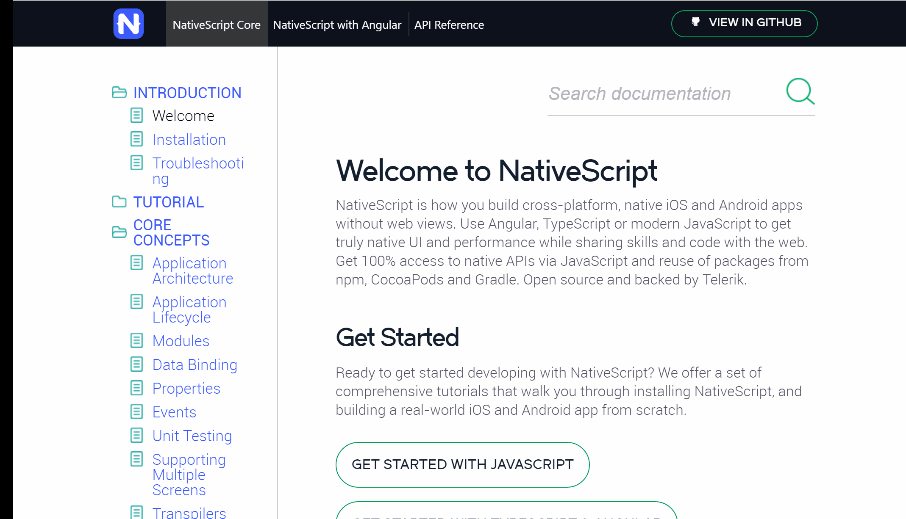

# Prospective 

There are a number of reasons I have decided to undertake this project:

## 1. NodeJs

I think it is really important that given the whole of nativescript is written in JS/TS and run on nodeJS, that the documentation site also runs on the same technology. This shows the core team are completely committed to the platform. Additionally, it smooths the learning curve for contributors in the docs repos to contribute to the core repos.

Hence the first piece of work on this project is to migrate from Jeckyll (ruby) to Hexo (nodeJS). 

## 2. Better Documentation Layout and a more user friendly UI

The documentation at the moment isn't presented in an easily browsable and inviting manor. The large cascading file trees with a single list of all docs (tutorials, cookbook, api reference, guides etc.) makes browsing difficult.

## 3. Better support on small screens

The folowing gif shows what the docs page looks like on my Surface Pro 3 with Google Chrome. Which has a small screen, but not unreasonably so (in my view). Notice that the spacing on the left-hand link menu means the doc names have split onto two lines. This has extended the length on menu making you have to scroll past quite a lot of white page to see all the options. 

## 4. 
This is a much more intangible point, but of the major platform (Xamarin, React Native and Cordova) I believe the nativescript pages look the least professional/developed. I think that when I was first investigating a platform, I saw the nativescript website and decided against it because it looked less polished. 

# This Approach

1. Rather than using Jeckyll, I have proposed [Hexo](https://hexo.io/), a nodeJS based static blog platform. It conviniently supports theming and custom rendering scripts.
2. The currently proposed theme allows for the tabbed seperation of Tutorials, Guides, API docs and signposts to Community communication channels
3. As above, the theme has a seperate scrolling feature for the API docs, auto expands and collapses each file and helps link to specific sections. 

* I am using a number of git submodules for:
- The Nativescript Theme 
- The Document Source Files
 
* There are a number of custom script block extentions, e.g. `nativescript`, `angular`, `snippet`

## ToDo:

1. Add all the docs
2. Build out the rest of docs site to avoid technology mix and to better segregate resources
* Build out the tutorial with this [tool](https://github.com/meteor/tutorial-tools)
* Use [VHost](https://github.com/expressjs/vhost) to segregate hexo server static docs and regular node app

3. Actually render the `snippet` blocks properly - where is this code coming from?
4. Tabbed Code Blocks - based on the [Materialize](http://materializecss.com/tabs.html) UI component
5. Hook Up the pseudo env variables for Angular Vs. Nativescript display.
6. Use proper svg Assets for Slack and SO Docs on sidebar
7. Look at the internal linking (I imagine some if not all of the links to other articles are now broken)